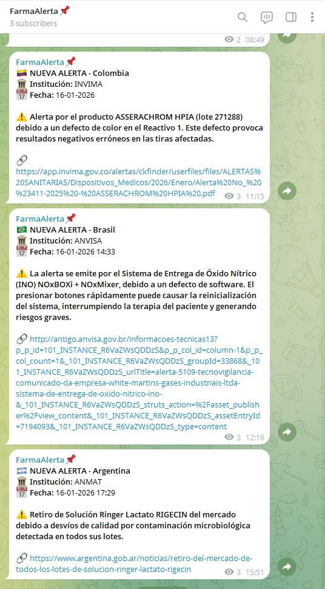
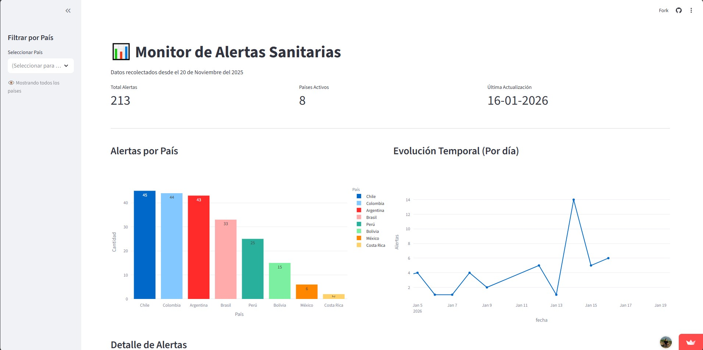
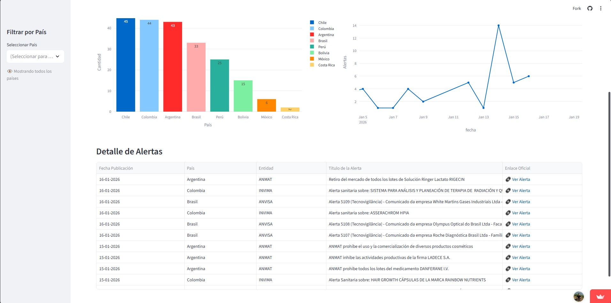

# 🔬 Alertas de Farmacovigilancia - Sistema de Monitoreo Automatizado

<p align="center">
  
  
  
  
</p>

<p align="center">
  <strong>
    Sistema automatizado de web scraping para la recolección y notificación en tiempo real
    de alertas sanitarias de agencias reguladoras de Latinoamérica.
  </strong>
</p>

<p align="center">
  
</p>

<p align="center">
  🔗 <strong><a href="https://t.me/+RZJkxkiG348zNDkx">Canal de Telegram con alertas en tiempo real</a></strong>
</p>

## 📋 Descripción

Este proyecto automatiza la **vigilancia regulatoria farmacéutica** mediante la extracción sistemática de alertas sanitarias desde múltiples fuentes oficiales. En un entorno donde las alertas de farmacovigilancia pueden surgir en cualquier momento y su conocimiento oportuno es **crítico para la seguridad del paciente**, contar con un sistema automatizado elimina la dependencia de revisiones manuales constantes.

### 🎯 ¿Por qué es importante?

La farmacovigilancia es la ciencia encargada de detectar, evaluar y prevenir efectos adversos de los medicamentos. En la región, cada agencia reguladora publica sus alertas en formatos y plataformas distintas, lo que dificulta el seguimiento manual. Este sistema:

- **Centraliza** la información de 8 países en un único flujo de datos
- **Automatiza** el monitoreo cada 15 minutos sin intervención humana
- **Notifica** en tiempo real a través de Telegram
- **Resume** el contenido con Inteligencia Artificial para una comprensión rápida

---

## 🌎 Cobertura

El sistema monitorea las siguientes agencias reguladoras:

| País | Institución | Tipo de Alertas |
|------|-------------|-----------------|
| 🇵🇪 Perú | **DIGEMID** | Medicamentos, Alertas y Modificaciones |
| 🇨🇱 Chile | **ISPCH** | Medicamentos, Dispositivos Médicos, Desinfectantes |
| 🇧🇷 Brasil | **ANVISA** | Alertas Sanitarias Generales |
| 🇨🇴 Colombia | **INVIMA** | Alertas Sanitarias Generales |
| 🇲🇽 México | **COFEPRIS** | Medicamentos, Dispositivos, Alimentos, Bebidas, Suplementos |
| 🇦🇷 Argentina | **ANMAT** | Medicamentos, Alimentos, Productos Médicos, Cosméticos |
| 🇧🇴 Bolivia | **AGEMED** | Vigilancia y Control, Seguridad (DTU) |
| 🇨🇷 Costa Rica | **MinSalud** | Radiológica, Productos en Mercado, Farmacovigilancia |

---

## ⚙️ Arquitectura del Sistema

```
┌─────────────────────────────────────────────────────────────────────────────┐
│                          GITHUB ACTIONS (cada 15 min)                       │
└─────────────────────────────────────┬───────────────────────────────────────┘
                                      │
                                      ▼
┌─────────────────────────────────────────────────────────────────────────────┐
│                         SCRAPERS EN PARALELO (8 países)                     │
│           🇵🇪 DIGEMID  🇨🇱 ISPCH  🇧🇷 ANVISA  🇨🇴 INVIMA  🇲🇽 COFEPRIS            │
│                    🇦🇷 ANMAT  🇧🇴 AGEMED  🇨🇷 MinSalud                          │
└─────────────────────────────────────┬───────────────────────────────────────┘
                                      │
                                      ▼
                       ┌──────────────────────────────┐
                       │  ¿NOVEDADES DETECTADAS?      │
                       │  (Comparación con historial) │
                       └──────────────┬───────────────┘
                                      │
                          ┌───────────┴───────────┐
                          │ SÍ                    │ NO
                          ▼                       ▼
              ┌─────────────────────┐    ┌────────────────┐
              │ Actualizar CSV      │    │   Terminar     │
              │ con nuevas alertas  │    └────────────────┘
              └──────────┬──────────┘
                         │
                         ▼
              ┌─────────────────────┐
              │ Extraer Contenido   │
              │ (HTML o PDF)        │
              └──────────┬──────────┘
                         │
                         ▼
              ┌─────────────────────┐
              │ Gemini AI           │
              │ (Generar Resumen)   │
              └──────────┬──────────┘
                         │
                         ▼
              ┌─────────────────────┐
              │ Enviar Mensaje      │
              │ a Telegram 📱       │
              └─────────────────────┘
```

### 🔧 Componentes Principales

| Archivo | Función |
|---------|---------|
| `main.py` | Orquestador principal; coordina scrapers, detección de novedades y envío |
| `scraper.py` | 8 funciones especializadas de scraping por país |
| `content_extractor.py` | Extracción inteligente de contenido HTML y PDF |
| `gemini_service.py` | Integración con Gemini AI para generar resúmenes |
| `extraction_config.json` | Configuración de selectores CSS por país |
| `dashboard.py` | Dashboard interactivo en Streamlit para visualización |

---

## 🚀 Instalación

### Prerrequisitos

- Python 3.12+
- Cuenta de Telegram con un Bot configurado
- API Key de Google Gemini

### Configuración

1. **Clonar el repositorio**

   ```bash
   git clone https://github.com/tu-usuario/web-scraping-farmacovigilancia.git
   cd web-scraping-farmacovigilancia
   ```

2. **Instalar dependencias**

   ```bash
   pip install -r requirements.txt
   ```

3. **Configurar variables de entorno**

   Crea un archivo `.env` en la raíz del proyecto:

   ```env
   TELEGRAM_TOKEN=tu_token_de_bot
   TELEGRAM_CHAT_ID=tu_chat_id
   GEMINI_API_KEY=tu_api_key_de_gemini
   ```

4. **Ejecutar manualmente**

   ```bash
   python main.py
   ```

---

## 📊 Flujo de Datos

1. **Recolección Paralela**: Los 8 scrapers se ejecutan simultáneamente
2. **Detección de Cambios**: Comparación con historial CSV para identificar novedades
3. **Extracción de Contenido**: Según el país, se extrae texto de HTML o PDF
4. **Generación de Resúmenes**: Gemini AI produce resúmenes concisos de 20-30 palabras
5. **Notificación**: Envío a Telegram con formato estructurado (país, institución, fecha, resumen)
6. **Persistencia**: Actualización del historial para evitar duplicados

---

## 📊 Dashboard de Visualización (Streamlit)

El proyecto incluye un **dashboard interactivo** desarrollado en Streamlit para explorar y analizar las alertas recolectadas de forma visual.

### Características

- **📈 KPIs en tiempo real**: Total de alertas, países activos, última actualización
- **📊 Gráfico de barras**: Distribución de alertas por país
- **📉 Serie temporal**: Evolución diaria de alertas publicadas
- **🔍 Tabla interactiva**: Detalle completo con enlaces directos a las alertas oficiales
- **🎛️ Filtros dinámicos**: Segmentación por país desde la barra lateral

### 🖥️ Vista general del dashboard

<p align="center">
  
</p>

> Panel principal con KPIs, distribución de alertas por país y evolución temporal.

### 🔍 Detalle y exploración de alertas

<p align="center">
  
</p>

> Tabla interactiva con el detalle completo de alertas y enlaces a fuentes oficiales.

### 🔗 Acceso al dashboard

👉 [Ver dashboard en vivo](https://web-scraping-alertas-farmacovigilancia-k7ugpeawwxhmx9yurfupbo.streamlit.app/)

### Ejecutar el Dashboard

```bash
streamlit run dashboard.py
```

El dashboard se actualiza automáticamente cada 2 minutos con los últimos datos del historial.

---

## ⏰ Automatización con GitHub Actions

El sistema se ejecuta automáticamente cada **15 minutos** en horario laboral (Lunes a Viernes, 06:00 - 23:00 UTC-5) mediante GitHub Actions.

```yaml
schedule:
  - cron: '*/15 11-23,0-4 * * 1-5'
```

Los cambios en el historial se persisten automáticamente en el repositorio mediante commits automatizados.

---

## 🛠️ Tecnologías Utilizadas

- **Web Scraping**: `BeautifulSoup`, `feedparser`, `curl_cffi`
- **Procesamiento**: `pandas` para manejo de datos tabulares
- **Extracción PDF**: `PyMuPDF (fitz)` para texto de documentos
- **IA Generativa**: Google Gemini API para resúmenes inteligentes
- **Notificaciones**: Telegram Bot API
- **Automatización**: GitHub Actions (cron jobs)
- **Concurrencia**: `concurrent.futures.ThreadPoolExecutor`

---

## 📁 Estructura del Proyecto

```
📦 Web Scraping/
├── 📄 main.py                  # Punto de entrada principal
├── 📄 scraper.py               # Scrapers por país
├── 📄 content_extractor.py     # Extracción HTML/PDF
├── 📄 gemini_service.py        # Integración con Gemini AI
├── 📄 dashboard.py             # Dashboard interactivo (Streamlit)
├── 📄 extraction_config.json   # Configuración de selectores
├── 📄 requirements.txt         # Dependencias Python
├── 📄 noticias_historial.csv   # Base de datos histórica
├── 📄 .env                     # Variables de entorno (no versionado)
└── 📁 .github/workflows/
    └── 📄 scraper_cron.yaml    # Configuración GitHub Actions
```

---

## 🤝 Contribuciones

¿Tienes ideas para mejorar el sistema o agregar nuevas agencias reguladoras? Las contribuciones son bienvenidas:

1. Haz fork del repositorio
2. Crea una rama para tu feature (`git checkout -b feature/nueva-agencia`)
3. Commit tus cambios (`git commit -m 'Agregar scraper para nueva agencia'`)
4. Push a la rama (`git push origin feature/nueva-agencia`)
5. Abre un Pull Request

---

## 📜 Licencia

Este proyecto está disponible como **código abierto** para fines **educativos, de investigación y uso personal**.

> 💼 Para implementaciones comerciales, empresariales o de producción a escala, por favor contáctame para discutir opciones de licenciamiento que se ajusten a tus necesidades.

---

## 👤 Autor

Johan Escobar  
Estudiante de Economía con interés en ciencia de datos y automatización.  
[LinkedIn](https://www.linkedin.com/in/johan-er/)

---

<p align="center">
  <sub>⭐ Si este proyecto te resulta útil, considera darle una estrella al repositorio ⭐</sub>
</p>
